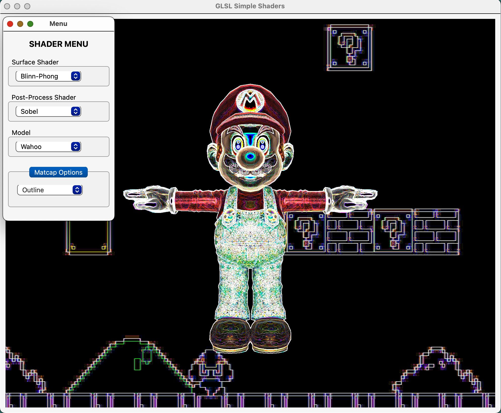

# GLSL Simple Shaders

**[Demo Video](https://youtu.be/YqdRmfLVsiI)**

### Overview

A collection of surface and post-process shaders to demonstrate GLSL best practices and toolbox functions for CG developers.

### Build Instructions

The easiest way to get this program running is to use an IDE like QT Creator and select the project root file at `glslSimpleShaders/glslSimpleShaders.pro`.